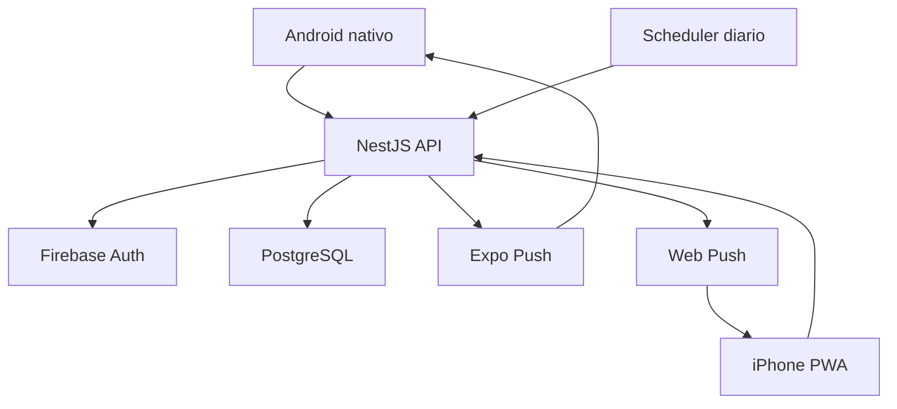
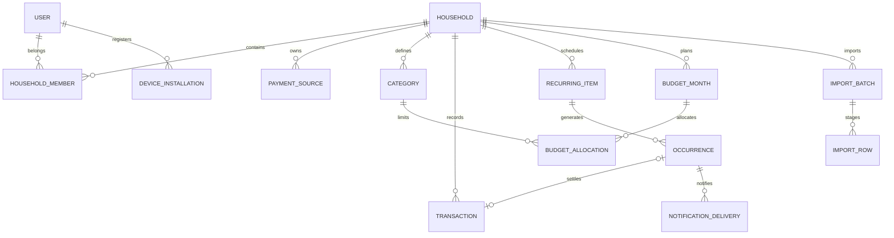
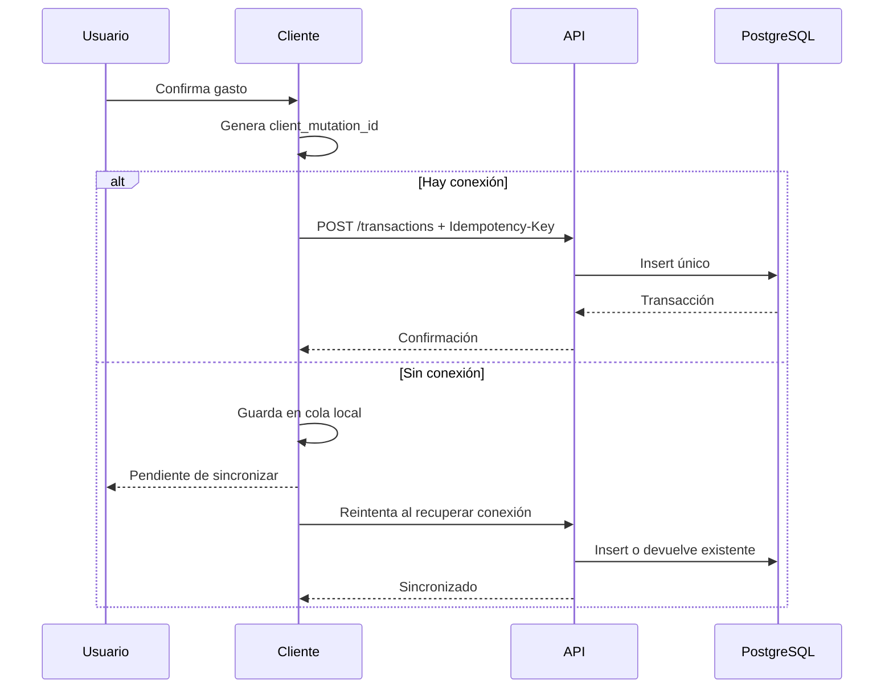

# System Design — Aplicación de control de gastos compartidos

**Estado:** system design y baseline UI v0.3 aprobados para iniciar desarrollo
**Fecha:** 15 de julio de 2026  
**Nombre de trabajo:** `Nido` (reemplazable)  
**Mercado inicial:** Paraguay  
**Idioma inicial:** español  
**Zona horaria:** `America/Asuncion`  
**Moneda base:** PYG (guaraní)

---

## 1. Resumen ejecutivo

La aplicación permitirá que dos integrantes de un hogar administren una economía completamente compartida. Cada integrante inicia sesión con Google y ve los mismos ingresos, gastos, presupuestos, medios de pago, obligaciones e informes. El sistema registra quién creó cada movimiento, pero no separa saldos personales ni calcula saldos bancarios.

El MVP se distribuirá como:

- aplicación Android nativa desarrollada con Expo/React Native;
- PWA instalable en iPhone desde el mismo proyecto universal;
- API modular en NestJS;
- PostgreSQL;
- autenticación con Google;
- notificaciones Expo Push en Android y Web Push en la PWA;
- funcionamiento online-first con creación offline limitada de ingresos y gastos;
- infraestructura sin costo fijo mensual.

Aunque al comienzo exista un solo hogar con dos usuarios, el modelo de datos será multi-hogar desde el primer día. Esto permite convertir el proyecto en producto comercial sin reescribir el dominio central.

## 2. Decisiones confirmadas

| Área | Decisión |
| --- | --- |
| Propiedad | Toda la economía es compartida |
| Identidad | Dos usuarios individuales, autenticados con Google |
| Plataforma | Android nativo + PWA instalada en iPhone |
| Carga | Manual y mediante CSV/XLSX |
| Offline | Online-first; creación offline limitada de movimientos |
| Medios de pago | Se registra el origen, sin calcular saldos |
| Monedas | PYG y USD; cambio manual |
| Presupuesto | Total mensual y límites por categoría |
| Meses futuros | Copiar presupuesto anterior sin acumular sobrantes |
| Gastos fijos | Importe estimado y real; sin pagos parciales |
| Ingresos | Esperados y luego recibidos |
| Recurrencias | Una vez, mensual, anual y cada X meses |
| Responsable | Cada obligación tiene un responsable |
| Notificaciones | Push al responsable |
| Categorías | Categoría y subcategoría opcional |
| Importación | Mapeo, previsualización, duplicados y reglas por descripción |
| Comprobantes | Fuera del MVP |
| Tarjetas | Sin cierres, cuotas ni estados de cuenta en el MVP |
| Exportación | Fuera del MVP |
| Auditoría | Sin historial completo de cambios |
| Crecimiento | Multi-hogar preparado; comercialización no inmediata |
| Infraestructura | USD 0 de costo fijo mensual |
| Baseline UI | Nido v0.3, diseñado y revisado en Claude Design |

## 3. Objetivos

1. Registrar un gasto en menos de 15 segundos.
2. Saber cuánto se gastó, en qué categorías y cuánto presupuesto queda.
3. Recordar vencimientos al integrante responsable.
4. Planificar el mes actual y meses futuros.
5. Importar extractos sin crear duplicados silenciosos.
6. Seguir funcionando cuando falte conexión al cargar un movimiento.
7. Mantener las reglas financieras independientes del proveedor de hosting, autenticación o push.
8. Servir como proyecto de portfolio con arquitectura defendible y pruebas automatizadas.

## 4. Fuera del alcance del MVP

- Sincronización automática con bancos.
- Saldos y conciliación bancaria.
- Cierres de tarjeta, cuotas e intereses.
- Finanzas personales privadas o división de gastos.
- Pagos parciales.
- Fotos de comprobantes.
- Exportación CSV/XLSX.
- Clasificación con IA.
- Historial completo de modificaciones.
- Edición o eliminación offline.
- Aplicación iOS nativa mientras no haya distribución Apple disponible.
- Suscripciones, facturación o administración pública de múltiples hogares.

## 5. Usuarios, roles y permisos

### Roles

- `OWNER`: crea el hogar, administra miembros y puede realizar todas las operaciones.
- `MEMBER`: administra todos los datos financieros del hogar, pero no puede eliminar el hogar ni expulsar al propietario.

En el MVP ambos pueden crear, editar y eliminar movimientos, presupuestos, categorías, medios de pago y reglas recurrentes.

### Incorporación

1. El primer usuario inicia sesión con Google.
2. Crea el hogar e indica su nombre.
3. Invita al segundo integrante por correo.
4. La invitación es de un solo uso, dura 72 horas y solo puede aceptarla el correo indicado.
5. El segundo usuario inicia sesión con Google y entra al hogar.

## 6. Requisitos funcionales

### 6.1 Movimientos diarios

Cada ingreso o gasto contiene:

- tipo: ingreso o gasto;
- importe;
- moneda: PYG o USD;
- tipo de cambio manual si la moneda es USD;
- importe histórico convertido a PYG;
- fecha y hora;
- categoría y subcategoría opcional;
- medio de pago/origen;
- comercio o descripción;
- notas opcionales;
- usuario que lo creó;
- origen: manual, importado o generado desde una obligación.

El importe debe enviarse como texto decimal en la API; nunca como `number` de JavaScript. Para USD, el usuario ingresa cuántos guaraníes representa USD 1. Los reportes usan la conversión guardada en el momento del movimiento.

### 6.2 Medios de pago

Los medios de pago no representan un ledger ni calculan saldo. Sirven para responder desde dónde se pagó o recibió el movimiento.

Tipos iniciales:

- cuenta bancaria;
- efectivo;
- tarjeta de crédito;
- billetera digital;
- otro.

Un medio puede indicar un titular informativo, aunque toda la información sea compartida. Ejemplos: “Ueno Kevin”, “Cuenta Ale”, “Efectivo”, “Ueno TC”.

### 6.3 Categorías

Se permiten dos niveles como máximo: categoría y subcategoría. Una categoría usada no se elimina; se archiva.

Categorías iniciales sugeridas:

| Categoría | Subcategorías sugeridas |
| --- | --- |
| Vivienda | Alquiler, mantenimiento |
| Alimentación | Supermercado, restaurantes, delivery |
| Transporte | Combustible, apps, mantenimiento, habilitación |
| Salud | Consultas, medicamentos, fisioterapia |
| Servicios | ANDE, ESSAP, internet, telefonía, suscripciones |
| Ocio | Salidas, streaming, juegos, eventos, viajes |
| Otros | Sin clasificar |

Categorías de ingreso: salario, freelance, reembolso, venta y otros.

### 6.4 Gastos fijos e ingresos esperados

Una regla recurrente describe lo que debería ocurrir. Una ocurrencia representa una obligación concreta. Una transacción representa el pago o cobro real.

Ejemplo:

- regla: “Internet, mensual, vence el día 10, estimado Gs. 200.000”;
- ocurrencia: “Internet julio 2026, vence 10/07/2026”;
- transacción: “Internet pagado 09/07/2026 por Gs. 198.500”.

Recurrencias permitidas:

- una sola vez;
- mensual;
- anual;
- cada X meses.

Cada regla tiene una primera fecha de vencimiento. Las siguientes fechas se calculan desde ella; si el día no existe en un mes —por ejemplo, día 31 en febrero— se usa el último día calendario de ese mes. Las ocurrencias se generan con 12 meses de anticipación. Cambiar una regla solo actualiza ocurrencias futuras pendientes; nunca modifica pagos o cobros ya realizados.

Estados:

- `PENDING`;
- `SETTLED` — se muestra como pagado o recibido según el tipo;
- `OVERDUE`;
- `SKIPPED`.

Marcar una ocurrencia como pagada o recibida crea una transacción vinculada en la misma transacción de base de datos. La relación es uno a uno y evita que se contabilice dos veces.

### 6.5 Notificaciones

Cada gasto fijo tiene un responsable. Solo ese usuario recibe sus notificaciones, aunque ambos vean la obligación.

Offsets iniciales:

- 7 días antes;
- 3 días antes;
- 1 día antes;
- el día del vencimiento.

Los offsets se pueden personalizar por regla. Si la obligación sigue pendiente después de la fecha, se marca vencida. El MVP no promete una hora exacta de entrega por utilizar infraestructura gratuita.

Canales:

- Android: Expo Push;
- iPhone PWA: Web Push con VAPID;
- futura app iOS: Expo Push sin cambiar el dominio.

### 6.6 Presupuestos

Cada mes puede tener:

- límite total en PYG;
- asignaciones por categoría raíz;
- importe aún sin distribuir;
- referencia al presupuesto del que fue copiado.

Reglas:

- la suma de asignaciones no puede superar el límite total;
- `sin_distribuir = límite_total - suma_asignaciones`;
- `disponible_total = límite_total - gastos_reales_del_mes`;
- `disponible_categoria = límite_categoria - gastos_reales_categoria`;
- `compromisos_pendientes = suma de gastos fijos pendientes del mes`;
- `proyectado_tras_pagar = disponible_total - compromisos_pendientes`;
- `porcentaje_proyectado = (gastos_reales + compromisos_pendientes) / límite_total`;
- los sobrantes no pasan al mes siguiente;
- copiar un mes copia límites, no movimientos;
- los gastos pendientes se muestran como proyección, pero no consumen el presupuesto real hasta pagarse;
- el balance del mes es `ingresos_reales - gastos_reales` y no debe confundirse con el presupuesto disponible.

### 6.7 Importación CSV/XLSX

Flujo:

1. Seleccionar archivo y medio de pago.
2. Elegir hoja si es XLSX.
3. Mapear columnas: fecha, descripción, importe, moneda, referencia y tipo.
4. Indicar formato de fecha y separadores.
5. Previsualizar filas normalizadas.
6. Aplicar reglas de categorización por descripción.
7. Marcar posibles duplicados y errores.
8. Permitir corregir, ignorar o confirmar filas.
9. Crear todas las transacciones válidas dentro de una operación atómica por lotes razonables.

Reglas de descripción:

- tipos: coincidencia exacta, comienza con o contiene;
- prioridad explícita;
- resultado: categoría/subcategoría propuesta;
- la categoría siempre se muestra antes de confirmar;
- el sistema puede ofrecer crear una regla a partir de una corrección repetida.

Duplicados:

- una referencia externa del banco es la señal fuerte;
- si no existe, se calcula una huella con medio de pago, fecha, importe, moneda y descripción normalizada;
- una huella heurística solo genera advertencia, porque pueden existir dos compras legítimas iguales;
- nunca se descarta silenciosamente una fila.

### 6.8 Dashboard e informes

El inicio muestra, para el mes seleccionado y en este orden:

1. balance del mes: `ingresos recibidos - gastos reales`;
2. presupuesto gastado, disponible hoy, compromisos pendientes y proyección tras pagarlos;
3. hasta tres obligaciones próximas o vencidas;
4. gasto por categorías raíz;
5. hasta cuatro movimientos recientes;
6. botón principal para registrar gasto.

El término “saldo” no se usa para este cálculo. Una ayuda contextual puede aclarar que los medios de pago no son saldos bancarios. Los compromisos pendientes no se presentan como gasto real hasta que se marcan pagados.

Una pantalla separada de informes contiene:

- gasto por categoría y subcategoría;
- presupuesto frente a gasto real;
- ingreso frente a gasto;
- evolución mensual;
- desglose por medio de pago.

### 6.9 Baseline UI aprobado — Nido v0.3

El diseño aprobado se originó en Claude Design y reemplaza los prompts de diseño anteriores. La referencia vigente vive en `design/nido-v0.3/`; este documento conserva las reglas funcionales que la implementación no puede inferir solo desde imágenes.

#### Sistema visual

- colores: primario `#1C4F47`, tinte primario `#E3EEE9`, acento terracota `#B4632F`, fondo `#F6F4EF`, superficie `#FFFFFF`, borde `#EAE7DF`, tinta `#26302C` y tinta secundaria `#5C6862`;
- semánticos: rojo `#B3372E`/`#FAE7E4`, ámbar `#8A5A00`/`#FBF0DC` y verde `#2F7D4E`/`#E4F1E8`;
- tipografía: Bricolage Grotesque 600 para títulos y montos grandes; IBM Plex Sans 400/500/600 para UI y texto; números tabulares;
- espaciado base de 4 px; margen de pantalla 16; separación entre tarjetas 12; padding de tarjeta 16;
- radios: tarjeta 16, pantalla/modal 28, botón 14 y chip 999; objetivos táctiles de al menos 44 px;
- marco base 390×844, verificado en 360×800 y 412×915, con safe areas y contenido vertical desplazable;
- bottom navigation persistente: Inicio, Movimientos, Presupuesto, Fijos y Más, excepto en invitación y Nuevo gasto.

#### Vocabulario y formato

- usar “Balance del mes”, nunca “saldo” para `ingresos recibidos - gastos reales`;
- usar “Compromisos pendientes” para fijos sin pagar y “Proyectado” para el disponible después de pagarlos;
- categorías raíz en resúmenes: Alimentación, Vivienda, Transporte, Salud, Servicios, Ocio y Otros; las subcategorías aparecen en detalle y carga;
- PYG sin decimales y con punto de miles, por ejemplo `Gs. 1.250.000`; USD con coma decimal, por ejemplo `USD 45,90`;
- copy en español con voseo paraguayo; estado nunca comunicado solo mediante color.

#### Comportamientos aprobados

- invitación dividida en estado previo editable y estado enviado; solo el Google email indicado puede aceptar, vence en 72 horas y permite reenviar o cancelar;
- Nuevo gasto es una pantalla completa: PYG por defecto, foco inicial en monto, selector USD con tipo de cambio manual, chips recientes/favoritos, subcategorías después de categoría y CTA sticky sobre teclado y safe area;
- al cerrar Nuevo gasto con datos se confirma antes de descartar;
- el modo offline confirma “Guardado en este teléfono”; Movimientos muestra un solo banner global con el contador de pendientes y estados por ítem sin duplicar el aviso;
- Movimientos incluye búsqueda y filtros; “Limpiar filtros” es neutral;
- el mes futuro permite planificar o copiar límites del mes anterior, sin arrastrar sobrantes ni movimientos;
- Presupuesto distingue dos barras y valores textuales: gasto real y proyección con compromisos; un porcentaje superior a 100 % debe mostrar el exceso de forma explícita;
- ante error de API se conserva y muestra el caché local; “Reintentar” es la acción principal y el código técnico aparece bajo “Detalles”.

#### Fixture visual canónico — julio de 2026

Este dataset es solo una fixture de diseño y pruebas visuales; no es seed de producción:

| Métrica | Valor |
| --- | ---: |
| Ingresos recibidos | Gs. 17.700.000 |
| Gastos reales | Gs. 14.320.000 |
| Balance del mes | +Gs. 3.380.000 |
| Presupuesto | Gs. 15.000.000 |
| Disponible hoy | +Gs. 680.000 |
| Compromisos pendientes | Gs. 3.505.000 |
| Proyectado tras pagarlos | −Gs. 2.825.000 |
| Consumo real / proyectado | 95 % / 119 % |

Las pantallas de referencia usan miércoles 15 de julio de 2026, el hogar “Casa Ale & Kevin” y los usuarios Ale y Kevin. Los valores de todas las pantallas deben cerrar contra esta misma fixture.

Para la invitación de prueba se usa `kevin@example.com`. En categorías, Alimentación Gs. 3.410.000 + Vivienda Gs. 2.800.000 + Servicios Gs. 940.000 + Transporte Gs. 780.000 + Ocio Gs. 630.000 + las demás categorías raíz Gs. 5.760.000 = Gs. 14.320.000.

## 7. Arquitectura lógica



### Enfoque

- Monolito modular, no microservicios.
- API stateless y escalable horizontalmente.
- PostgreSQL como fuente de verdad.
- Tabla outbox/deliveries en PostgreSQL en lugar de Redis para el MVP.
- Puertos de dominio para autenticación, notificaciones y scheduler.
- Contratos compartidos y validados con Zod.

### Módulos NestJS

- `auth`
- `users`
- `households`
- `categories`
- `payment-sources`
- `transactions`
- `recurring-items`
- `budgets`
- `imports`
- `reports`
- `notifications`
- `devices`
- `health`

Los controladores solo validan y delegan. Las reglas viven en servicios de aplicación y objetos de dominio. Los repositorios encapsulan Prisma/PostgreSQL.

## 8. Estructura del monorepo

```text
apps/
  mobile/          # Expo Router: Android y PWA
  api/             # NestJS
packages/
  contracts/       # DTOs y esquemas Zod compartidos
  domain-types/    # Money, Currency, Frequency y enums puros
  config/          # ESLint, TypeScript y configuración compartida
docs/
  adr/
  system-design.md
```

Se recomienda pnpm workspaces y Turborepo. La lógica visual no importa entidades de Prisma. La API no importa componentes móviles.

## 9. Modelo de datos



### Entidades principales

#### `users`

- `id uuid pk`
- `firebase_uid text unique`
- `email text unique`
- `display_name text`
- `avatar_url text nullable`
- `timezone text`
- `created_at`, `updated_at`

#### `households`

- `id uuid pk`
- `name text`
- `base_currency char(3)` — inicialmente `PYG`
- `timezone text`
- `created_by uuid fk users`
- timestamps

#### `household_members`

- `household_id uuid`
- `user_id uuid`
- `role OWNER | MEMBER`
- `status ACTIVE | REMOVED`
- `joined_at`
- PK compuesta `(household_id, user_id)`

#### `household_invites`

- `id uuid pk`
- `household_id`
- `email_normalized`
- `token_hash`
- `expires_at`, `used_at`
- `created_by`

#### `payment_sources`

- `id uuid pk`
- `household_id`
- `name`
- `type BANK_ACCOUNT | CASH | CREDIT_CARD | DIGITAL_WALLET | OTHER`
- `owner_user_id nullable`
- `is_active`
- timestamps

#### `categories`

- `id uuid pk`
- `household_id`
- `kind EXPENSE | INCOME`
- `parent_id nullable`
- `name`
- `icon`, `color`, `sort_order`
- `is_active`

Restricciones: máximo dos niveles; nombre único entre hermanos activos.

#### `transactions`

- `id uuid pk`
- `household_id`
- `type EXPENSE | INCOME`
- `amount decimal`
- `currency PYG | USD`
- `fx_rate_to_base decimal`
- `base_amount_pyg decimal(18,0)`
- `occurred_at timestamptz`
- `local_date date`
- `category_id`
- `payment_source_id nullable`
- `description`
- `notes nullable`
- `origin MANUAL | IMPORT | RECURRING`
- `source_occurrence_id unique nullable`
- `external_reference nullable`
- `client_mutation_id uuid nullable`
- `created_by`, `updated_by`
- timestamps

Índices mínimos:

- `(household_id, local_date desc)`;
- `(household_id, category_id, local_date)`;
- `(household_id, payment_source_id, local_date)`;
- unique parcial `(created_by, client_mutation_id)` cuando no es nulo;
- unique parcial `(household_id, payment_source_id, external_reference)` cuando no es nulo.

#### `recurring_items`

- `id uuid pk`
- `household_id`
- `kind EXPENSE | INCOME`
- `name`, `description nullable`
- `category_id`, `payment_source_id nullable`
- `responsible_user_id nullable`
- `estimated_amount`, `currency`, `planned_fx_rate_to_base`
- `frequency ONE_TIME | MONTHLY | YEARLY | EVERY_N_MONTHS`
- `interval_months nullable`
- `first_due_date`, `end_date nullable`
- `notification_offsets int[]`
- `is_active`
- timestamps

#### `occurrences`

- `id uuid pk`
- `recurring_item_id`
- `household_id`
- `due_date`
- copia de importe, moneda, cambio planeado y responsable;
- `status PENDING | SETTLED | OVERDUE | SKIPPED`
- `settled_at nullable`
- timestamps
- unique `(recurring_item_id, due_date)`

#### `budget_months`

- `id uuid pk`
- `household_id`
- `month date` — siempre primer día del mes;
- `total_limit_pyg decimal(18,0)`
- `copied_from_id nullable`
- unique `(household_id, month)`

#### `budget_allocations`

- `budget_month_id`
- `category_id` — categoría raíz de gasto;
- `amount_pyg decimal(18,0)`
- unique `(budget_month_id, category_id)`

#### `device_installations`

- `id uuid pk`
- `user_id`
- `platform ANDROID | WEB | IOS`
- `provider EXPO | WEB_PUSH`
- token Expo o suscripción Web Push cifrada;
- `is_active`, `last_seen_at`

#### `notification_deliveries`

- `id uuid pk`
- `occurrence_id`, `user_id`, `device_installation_id`
- `offset_days`
- `status PENDING | SENT | FAILED | SKIPPED`
- `attempt_count`, `provider_message_id`, `error_code`
- `scheduled_for`, `sent_at`
- unique `(occurrence_id, device_installation_id, offset_days)`

#### `import_batches`, `import_rows`, `categorization_rules`

Conservan mapeo, previsualización, errores y posibles duplicados. Las filas temporales se eliminan después de confirmar o tras siete días. El archivo original no se conserva en el MVP.

## 10. Flujos críticos

### Registrar un gasto online u offline



### Pagar un gasto fijo

1. Se bloquea la ocurrencia dentro de una transacción SQL.
2. Se valida que siga pendiente o vencida.
3. Se crea la transacción con el importe real y cambio manual si corresponde.
4. Se vincula `source_occurrence_id`.
5. Se marca la ocurrencia como `SETTLED`.
6. Se cancelan entregas de notificación pendientes.
7. Se devuelve ocurrencia y transacción.

### Procesar notificaciones

1. El scheduler llama un endpoint interno autenticado una vez al día.
2. La API adquiere un advisory lock de PostgreSQL.
3. Genera ocurrencias faltantes dentro del horizonte de 12 meses.
4. Marca como vencidas las ocurrencias pendientes anteriores a hoy.
5. Calcula offsets que corresponden al día.
6. Inserta deliveries con restricción única.
7. Envía Expo Push o Web Push.
8. Registra resultado y reintenta fallos transitorios como máximo tres veces.

Si el scheduler gratuito se retrasa, la primera apertura autenticada del día ejecuta un barrido protegido por el mismo lock. Esto evita depender de una sola señal, aunque no convierte la entrega en tiempo real garantizado.

## 11. Sincronización offline limitada

### Incluido

- crear gastos;
- crear ingresos;
- visualizar el último snapshot sincronizado;
- reintentar automáticamente;
- mostrar `pendiente`, `sincronizando`, `sincronizado` o `error`.

### No incluido

- editar o eliminar offline;
- importar offline;
- crear categorías o presupuestos offline;
- resolver cambios concurrentes generales.

### Almacenamiento

- Android: SQLite mediante una abstracción `SyncStore`;
- PWA: IndexedDB detrás de la misma interfaz;
- app shell PWA: service worker;
- secretos de autenticación: almacenamiento seguro provisto por el SDK correspondiente.

Nunca se borra una mutación no sincronizada al cerrar sesión sin advertir al usuario.

## 12. API propuesta

Prefijo: `/v1`. Todas las rutas financieras requieren token válido y membresía activa en el hogar.

### Identidad y hogar

- `GET /me`
- `POST /households`
- `GET /households/:householdId`
- `POST /households/:householdId/invites`
- `POST /invites/:token/accept`
- `GET /households/:householdId/members`

### Categorías y medios

- `GET|POST /households/:householdId/categories`
- `PATCH|DELETE /households/:householdId/categories/:id`
- `GET|POST /households/:householdId/payment-sources`
- `PATCH|DELETE /households/:householdId/payment-sources/:id`

`DELETE` archiva cuando existen referencias.

### Movimientos

- `GET /households/:householdId/transactions`
- `POST /households/:householdId/transactions`
- `GET|PATCH|DELETE /households/:householdId/transactions/:id`

Filtros: rango de fechas, tipo, categoría, medio, usuario, moneda y búsqueda textual.

### Recurrentes

- `GET|POST /households/:householdId/recurring-items`
- `GET|PATCH|DELETE /households/:householdId/recurring-items/:id`
- `GET /households/:householdId/occurrences`
- `POST /households/:householdId/occurrences/:id/settle`
- `POST /households/:householdId/occurrences/:id/skip`

### Presupuestos e informes

- `GET|PUT /households/:householdId/budgets/:yyyyMm`
- `POST /households/:householdId/budgets/:yyyyMm/copy`
- `GET /households/:householdId/reports/monthly-summary`
- `GET /households/:householdId/reports/category-breakdown`
- `GET /households/:householdId/reports/trends`

### Importación

- `POST /households/:householdId/imports`
- `PATCH /households/:householdId/imports/:id/mapping`
- `GET /households/:householdId/imports/:id/preview`
- `PATCH /households/:householdId/imports/:id/rows/:rowId`
- `POST /households/:householdId/imports/:id/commit`

### Dispositivos y jobs

- `POST /devices/register`
- `DELETE /devices/:id`
- `POST /internal/jobs/due-notifications` — secreto HMAC, no token de usuario.

## 13. Seguridad y privacidad

- Verificar Firebase ID Token en la API, no confiar en datos del cliente.
- Validar membresía del hogar en cada consulta y mutación.
- Incluir `household_id` en todos los índices y repositorios multi-tenant.
- No aceptar un `household_id` sin resolverlo contra el usuario autenticado.
- Validación Zod en los límites del sistema.
- Consultas parametrizadas mediante Prisma.
- Invitaciones de un solo uso, con token almacenado como hash.
- HTTPS obligatorio.
- Rate limiting para autenticación, invitaciones e importaciones.
- Máximo de archivo inicial: 10 MB.
- Solo CSV y XLSX; no ejecutar fórmulas ni macros.
- No registrar importes, descripciones, tokens o contenido de archivos en logs.
- Cifrar las suscripciones Web Push almacenadas.
- Confirmar antes de eliminar movimientos.
- Los backups dependen del proveedor gratuito durante el MVP; antes de uso comercial se requiere política de backup propia.

## 14. Requisitos no funcionales

- Accesibilidad: contraste WCAG AA, targets táctiles de al menos 44×44, labels para lectores y gráficos con alternativa textual.
- Rendimiento warm: P95 de lecturas comunes menor a 500 ms para el tamaño del MVP.
- Cold start gratuito: puede acercarse a un minuto y debe mostrarse como “Conectando…” sin duplicar requests.
- Fechas: almacenar UTC y fecha local; agrupar por `America/Asuncion`.
- Dinero: usar decimal, nunca coma flotante.
- Idempotencia: obligatoria en creación offline, importación y liquidación de ocurrencias.
- Compatibilidad objetivo: últimas dos versiones principales de Android; iOS 16.4+ para Web Push.
- Observabilidad: logs estructurados con `request_id`, `user_id` y `household_id` sin payload financiero.
- Salud: `/health/live` y `/health/ready`.

## 15. Despliegue de costo fijo cero

### Perfil MVP

| Componente | Servicio | Límite/compromiso aceptado |
| --- | --- | --- |
| Android builds/updates | Expo Free | cuota gratuita; cola de baja prioridad |
| PWA estática | Cloudflare Pages Free | hosting estático sin costo fijo |
| API NestJS | Render Free Web Service | duerme tras inactividad y tarda cerca de un minuto en despertar |
| PostgreSQL | Neon Free | 0,5 GB; al alcanzar el límite se rechazan nuevas escrituras |
| Google login | Firebase Auth Spark | muy por encima de los dos usuarios iniciales |
| Scheduler | GitHub Actions diario | puede retrasarse o descartarse bajo carga |
| Android push | Expo Push | sin costo para el volumen del MVP |
| PWA push | Web Push/VAPID | sin costo de proveedor obligatorio |

No se debe adjuntar un método de pago ni habilitar gasto adicional automático en los servicios usados por este perfil. Si un servicio exige facturación para una característica, esa característica no forma parte del perfil cero.

### Ruta comercial futura

Sin cambiar contratos de dominio:

- mover API a compute siempre activo;
- reemplazar scheduler por cola durable y worker;
- añadir Redis solo cuando existan cargas que lo justifiquen;
- ampliar PostgreSQL y backups;
- agregar observabilidad y alertas con SLA;
- generar aplicación iOS nativa;
- incorporar privacidad, exportación y eliminación de cuenta;
- evaluar suscripciones y límites por plan.

## 16. Estrategia de pruebas

### Unitarias

- conversiones PYG/USD;
- recurrencias y fechas límite;
- presupuestos y categorías;
- transición de estados;
- fingerprints de importación;
- selección de notificaciones.

### Integración

- repositorios contra PostgreSQL efímero;
- liquidación atómica de ocurrencias;
- idempotencia de movimientos;
- autorización entre hogares;
- commit de importación;
- outbox/deliveries.

### API/E2E

- onboarding e invitación;
- gasto manual;
- reintento offline duplicado;
- gasto fijo pagado;
- presupuesto copiado;
- importación con duplicado;
- acceso rechazado a otro hogar.

### Cliente

- estados offline y sincronización;
- formularios de dinero;
- navegación y accesibilidad;
- Android físico y PWA instalada en iPhone;
- recepción de push real en ambos dispositivos.

## 17. Roadmap de implementación para Codex

### M0 — Repositorio y decisiones

- Monorepo pnpm/Turborepo.
- Expo Router, NestJS y paquetes compartidos.
- Docker Compose para PostgreSQL local.
- CI: lint, typecheck y tests.
- ADRs de dinero, multi-tenancy, offline y despliegue cero.
- `AGENTS.md` con comandos, convenciones, límites y definición de terminado.
- Shell mínimo de navegación con tokens base de Nido v0.3, sin lógica financiera.

**Aceptación:** instalación reproducible y pipeline verde.

### M1 — Auth y hogar

- Google/Firebase Auth.
- Guard NestJS.
- Usuarios, hogares, miembros e invitaciones.
- Aislamiento multi-tenant probado.

### M2 — Catálogo financiero

- Categorías/subcategorías.
- Medios de pago.
- Seeds iniciales.
- Configuración básica en la app.

### M3 — Movimientos y dashboard

- CRUD de ingresos/gastos.
- Dinero y cambio manual.
- Lista, filtros y resumen mensual.
- Dashboard inicial.

### M4 — Carga offline limitada

- `SyncStore` Android/web.
- Cola, estados visuales y reintentos.
- Idempotencia server-side.
- Pruebas de reconexión y duplicados.

### M5 — Recurrentes

- Reglas y generación de ocurrencias.
- Gastos estimados/reales.
- Ingresos esperados/recibidos.
- Liquidación atómica y vencidos.

### M6 — Presupuestos e informes

- Presupuesto mensual y asignaciones.
- Copiar mes.
- Proyecciones de fijos.
- Desgloses y tendencias.

### M7 — Notificaciones

- Registro de dispositivos.
- Expo Push y Web Push.
- Delivery outbox e idempotencia.
- Scheduler y fallback al abrir la app.

### M8 — Importación

- CSV/XLSX, mapeo y preview.
- Reglas por descripción.
- Detección de posibles duplicados.
- Commit seguro.

### M9 — Hardening y distribución

- Rate limits, redacción de logs y límites de archivo.
- Deploy cero.
- APK interno y PWA instalable.
- Pruebas físicas y documentación de operación.

## 18. Handoff de diseño aprobado — Claude Design Nido v0.3

La sección estructural `t3` de Nido v0.3 es el baseline visual para desarrollo. Las menciones v0.1 y v0.2 quedan preservadas únicamente como historial dentro del documento generado, no como fuentes activas. La prioridad de fuentes es:

1. este system design para dominio, seguridad, cálculos y alcance;
2. la especificación v0.3 de la sección 6.9 para vocabulario y comportamiento;
3. la sección `t3` de Nido v0.3 para composición visual;
4. las anotaciones de diseño para scroll, sticky CTA, teclado, offline y responsive.

Si una captura contradice una invariante financiera o una regla de accesibilidad, prevalece este documento y se registra la diferencia. No se deben deducir reglas de negocio a partir de valores aislados en una imagen.

Antes de M3, guardar en el repositorio:

```text
docs/
  system-design.md
design/
  nido-v0.3/
    README.md
    Nido - Sistema y pantallas.dc.html
    support.js
```

## 19. Backlog de diseño posterior a v0.3

El desarrollo puede comenzar con M0. Antes de implementar cada módulo todavía no cubierto por las capturas, completar su lote de diseño y consistencia:

- Fijos e ingresos esperados: lista/calendario, regla recurrente, ocurrencia y liquidación con importe real;
- importación CSV/XLSX: selección, mapeo, preview, duplicados y confirmación;
- informes: categoría/subcategoría, presupuesto frente a real, ingresos frente a gastos, evolución y medio de pago;
- configuración: hogar, miembros, categorías, medios, notificaciones y cierre de sesión;
- detalle/edición de movimiento, confirmaciones destructivas y estados de permisos de push.

Cada lote debe reutilizar los tokens, vocabulario, navegación, fixture canónica y reglas responsive de la v0.3. No debe ampliar el alcance del MVP.

## 20. Goal y primer task para Codex

### Goal persistente recomendado

```text
Construir el MVP de Nido de M0 a M9 siguiendo docs/system-design.md y el baseline UI Claude Design Nido v0.3, con hitos revisables, pruebas automatizadas, aislamiento multi-hogar y costo fijo mensual de infraestructura igual a USD 0. Continuar un hito por vez y no avanzar al siguiente hasta cumplir y reportar sus criterios de aceptación.
```

El goal mantiene el objetivo de largo plazo. El siguiente prompt es el primer task y debe ejecutar **solo M0**.

### Prompt para Codex — M0

```text
Actuá como el senior engineer responsable de iniciar Nido. Trabajá directamente en este repositorio y completá Milestone M0 solamente.

GOAL
Dejar una base reproducible, estricta y verificada para desarrollar Nido desde M1, sin implementar todavía funcionalidades financieras.

CONTEXTO OBLIGATORIO
1. Leé docs/system-design.md completo.
2. Inspeccioná design/nido-v0.3/. La sección estructural t3 es el baseline visual aprobado de Claude Design.
3. El system design prevalece para dominio, cálculos, seguridad, arquitectura y alcance. El baseline UI prevalece para presentación y comportamiento visual, salvo que contradiga una invariante, accesibilidad o seguridad.
4. Si el repositorio está vacío, inicializalo. Si ya contiene cambios, preservá todo lo ajeno al task.
5. Usá versiones estables, actuales y compatibles entre sí; documentá y fijá las versiones elegidas.

ALCANCE M0
- monorepo con pnpm workspace y Turborepo;
- apps/mobile con Expo Router para Android y web/PWA;
- apps/api con NestJS;
- packages/contracts, packages/domain-types y packages/config;
- TypeScript estricto compartido, lint, formato, typecheck y unit tests;
- Docker Compose con PostgreSQL para desarrollo local;
- validación tipada de variables de entorno y archivos .env.example sin secretos;
- CI con instalación reproducible, lint, typecheck y tests;
- docs/adr con decisiones de representación de dinero, aislamiento por household_id, idempotencia offline y perfil de despliegue de costo fijo USD 0;
- endpoint mínimo de health en la API;
- shell mínimo de navegación mobile con Inicio, Movimientos, Presupuesto, Fijos y Más, usando tokens básicos de Nido v0.3 y sin pantallas financieras;
- README con requisitos, instalación, comandos y troubleshooting básico;
- AGENTS.md breve con layout del repo, comandos válidos, convenciones, límites de alcance y definición de done.

FUERA DE ALCANCE
- autenticación, base de datos de dominio, CRUD financiero, sincronización offline, presupuestos, recurrencias, notificaciones e importación;
- mocks extensos o lógica placeholder de hitos futuros;
- deploy, commit, push o apertura de PR, salvo autorización explícita.

FORMA DE TRABAJO
1. Inspeccioná el repo y resumí restricciones o contradicciones reales.
2. Escribí un plan breve y concreto; después implementalo en este mismo task. Preguntá solo si aparece un bloqueo que cambie materialmente la arquitectura.
3. Verificá progresivamente y corregí los fallos encontrados.
4. No declares éxito basándote solo en archivos generados.

DONE WHEN
- una instalación limpia con lockfile funciona;
- lint, formato/check, typecheck y tests quedan verdes;
- el build web/PWA de mobile termina correctamente;
- la configuración Android de desarrollo es válida;
- la API inicia y su health check responde exitosamente;
- Docker Compose valida y PostgreSQL puede iniciar cuando Docker esté disponible;
- no hay secretos ni dependencias de dominio prematuras;
- README y ADRs reflejan exactamente lo implementado.

ENTREGA FINAL
Hacé un self-review de nivel staff. Informá archivos cambiados, decisiones, comandos ejecutados y resultados, checks no ejecutables con motivo, riesgos pendientes y el task exacto recomendado para M1. No avances a M1.
```

## 21. Riesgos y mitigaciones

| Riesgo | Impacto | Mitigación MVP |
| --- | --- | --- |
| Cold start del backend | Primera carga lenta | Estado “Conectando”, retry, caché local |
| Scheduler gratuito retrasado | Push fuera de hora | Job diario + fallback al abrir app + idempotencia |
| Límite de Neon | Escrituras bloqueadas | Métricas de uso, limpiar staging, no guardar archivos |
| Duplicados offline/importados | Totales incorrectos | IDs idempotentes, referencia externa y warnings |
| Cambio mal cargado | Reportes incorrectos | Confirmación visible y edición antes de guardar |
| Pérdida de mutación offline | Gasto no registrado | Cola durable y advertencia al cerrar sesión |
| Fuga entre hogares | Riesgo crítico | Autorización server-side e integración negativa |
| Diseño UI incompleto | Implementación inconsistente | Baseline Nido v0.3 + lotes restantes antes de cada módulo |
| Evolución a producto | Reescritura | `household_id`, adapters y monolito modular desde M0 |

## 22. Criterio de salida del MVP

El MVP estará listo cuando Kevin y Ale puedan:

1. entrar con sus cuentas Google al mismo hogar;
2. registrar gastos e ingresos en PYG y USD;
3. registrar un gasto sin conexión y verlo sincronizado una sola vez;
4. administrar categorías y medios de pago;
5. planificar y copiar presupuestos mensuales;
6. crear gastos fijos e ingresos esperados;
7. marcar obligaciones como pagadas/recibidas sin doble contabilización;
8. recibir notificaciones en Android y en la PWA del iPhone;
9. importar un CSV/XLSX revisando categorías y duplicados;
10. consultar dashboard e informes consistentes;
11. instalar el APK privado y la PWA;
12. ejecutar toda la infraestructura sin costo fijo mensual.

## 23. Referencias verificadas

- [Expo: aplicaciones Android, iOS y web](https://docs.expo.dev/workflow/overview/)
- [Expo: PWA](https://docs.expo.dev/guides/progressive-web-apps/)
- [Expo: notificaciones push](https://docs.expo.dev/push-notifications/push-notifications-setup/)
- [Expo Free plan](https://expo.dev/pricing)
- [Apple/WebKit: Web Push para Home Screen apps](https://webkit.org/blog/13878/web-push-for-web-apps-on-ios-and-ipados/)
- [Firebase Authentication y límites gratuitos](https://firebase.google.com/docs/auth)
- [Render Free](https://render.com/docs/free)
- [Neon Free](https://neon.com/pricing)
- [GitHub Actions programadas](https://docs.github.com/actions/using-workflows/events-that-trigger-workflows#schedule)
- [Cloudflare Pages Free limits](https://developers.cloudflare.com/pages/platform/limits/)
